
<h1 align="center">基于web的垃圾分类回收系统</h1>

## 简介
基于Web的垃圾分类回收系统，角色分为管理员和用户；功能包括垃圾回收点管理、垃圾运输管理、用户信息管理、公告管理、反馈管理，旨在提高垃圾分类效率和管理便捷性。    --计算机毕业设计源码；毕设源码；java毕业设计源码

## 联系方式

<h3 align="center">获取完整代码与数据库文件 + 微信：deepguan QQ: 86050149 QQ群: 783742310</h3>

<h3 align="center">可帮忙远程部署 包运行成功！提供远程部署、修改代码、设计文档指导、代码讲解等服务！</h3>

## 功能介绍（完整见运行截图）
管理员：提供用户管理、垃圾反馈管理、垃圾出库申请管理模块。可查看和审批垃圾出库申请，填写申请理由、审核时间等，支持运输目的地选择和照片上传。管理垃圾回收信息及运输记录，提供详细查看、修改、删除等操作。支持公告管理功能，包括公告添加、删除、搜索和详细信息查看。

用户：提供登录和注册功能，支持查看不同垃圾分类信息和预约上门回收服务。可查看个人回收记录，管理个人资料。用户中心提供修改密码功能。用户可通过运输管理模块查看运输信息及操作申请。支持垃圾回收记录的输入与管理，用户可选择回收类型、输入库存和上传图片。

## 运行截图
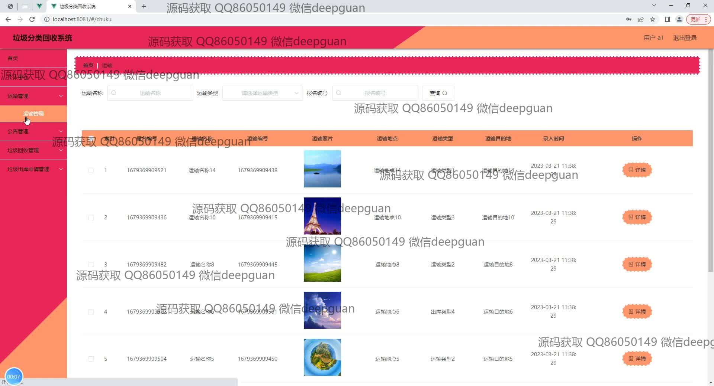
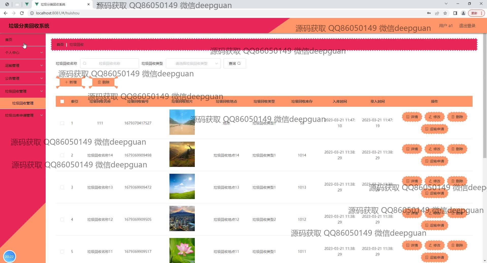
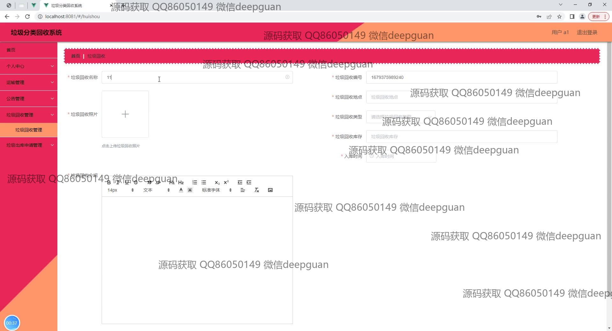
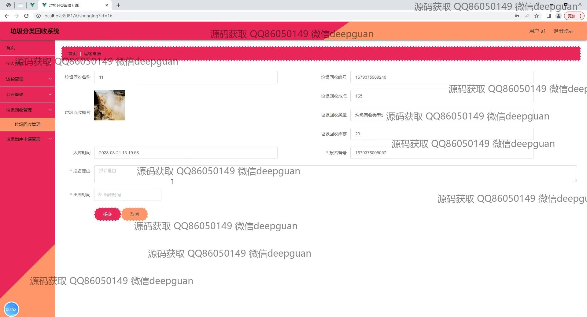
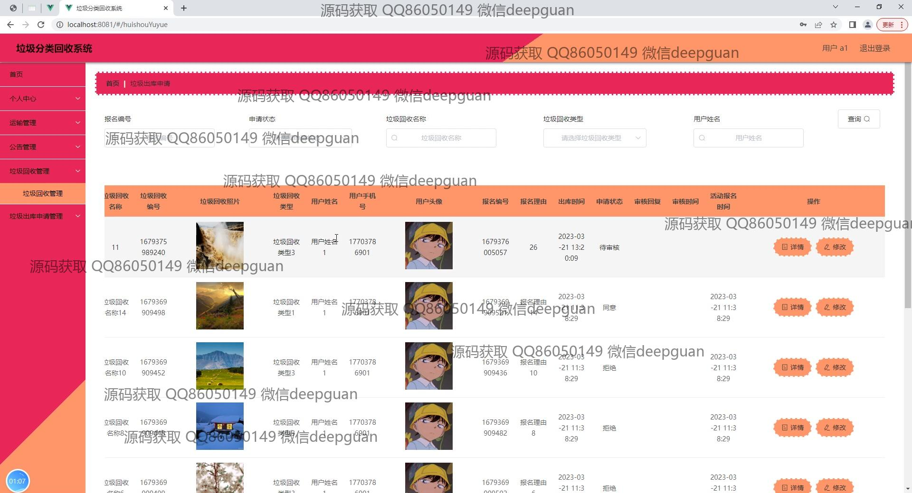
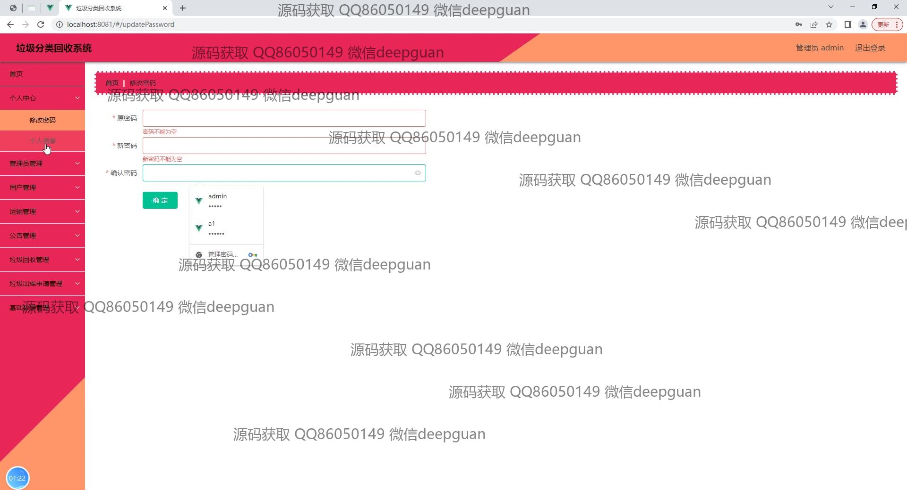
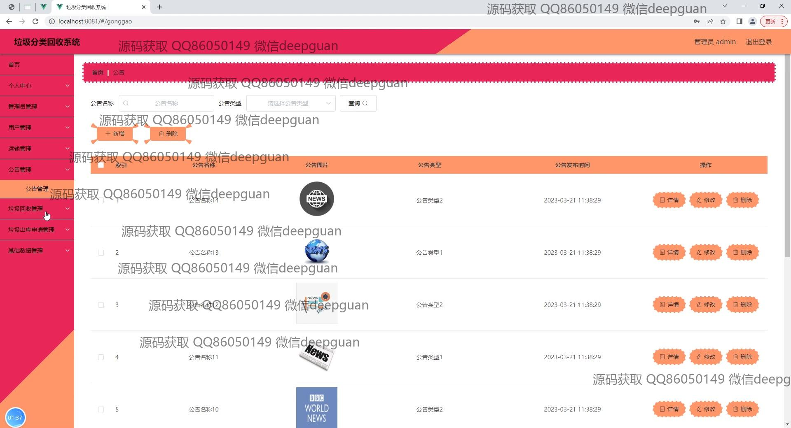
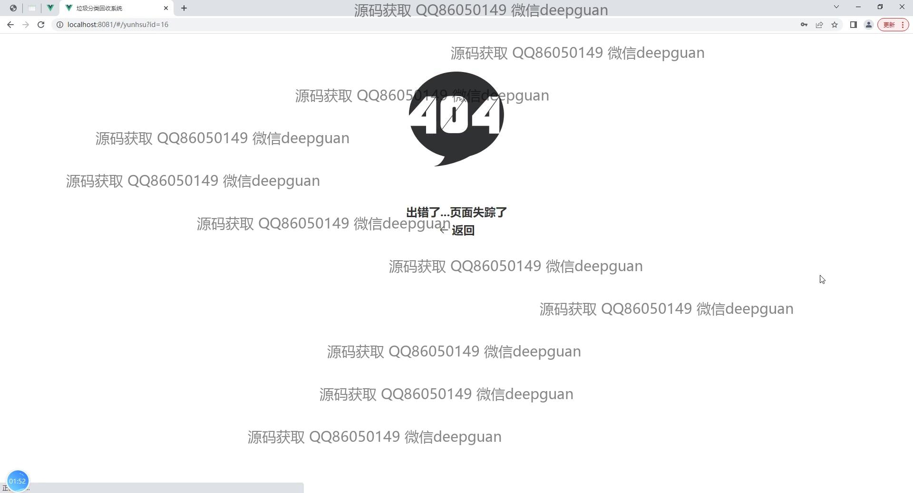
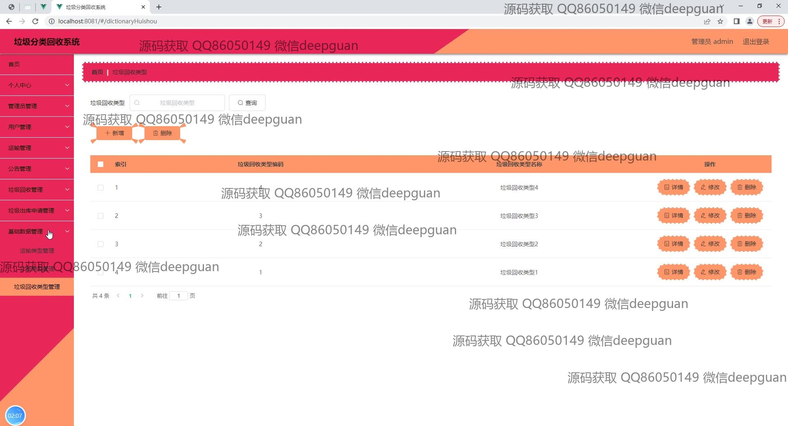
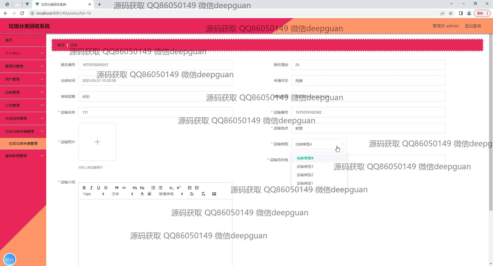
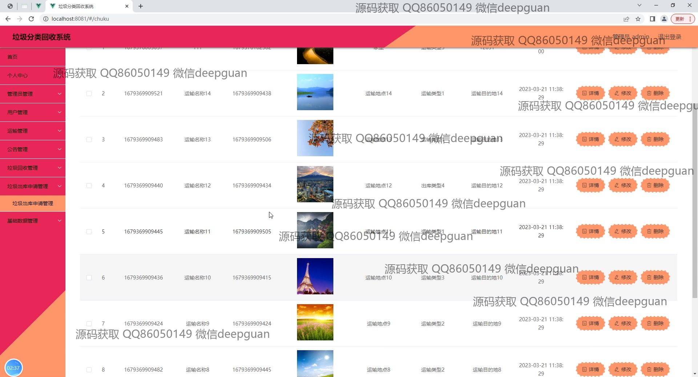

本代码来源于网络,仅供学习参考使用!

